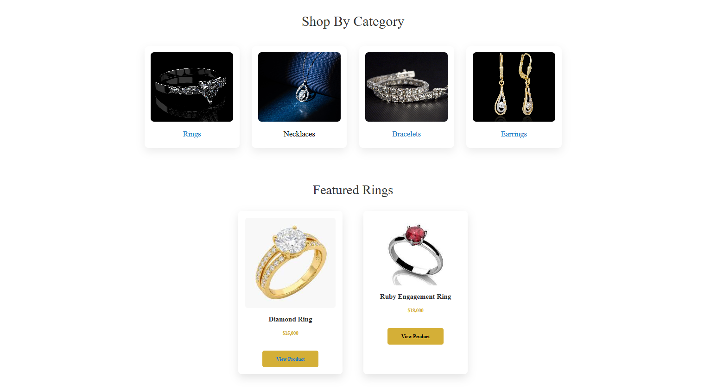
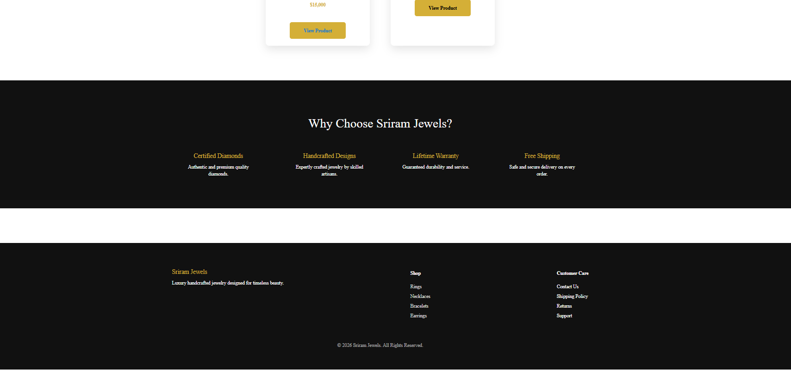
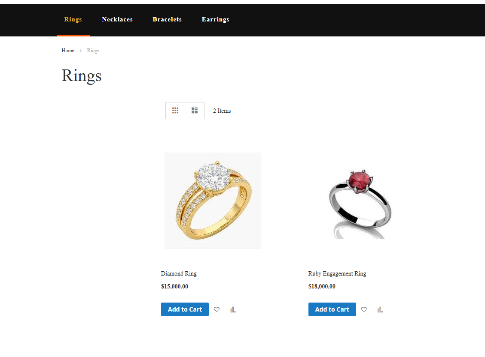
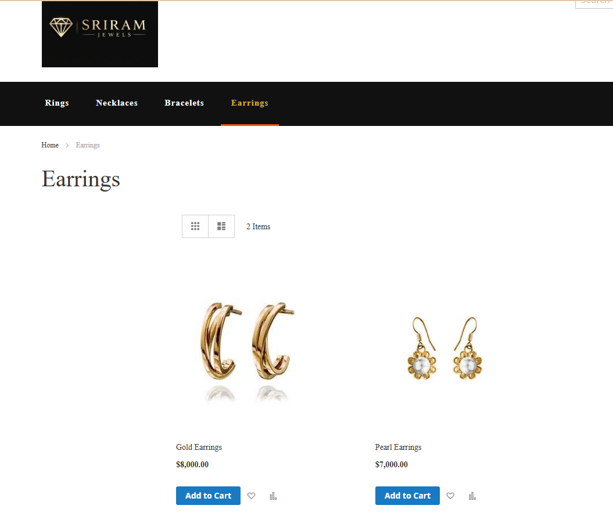
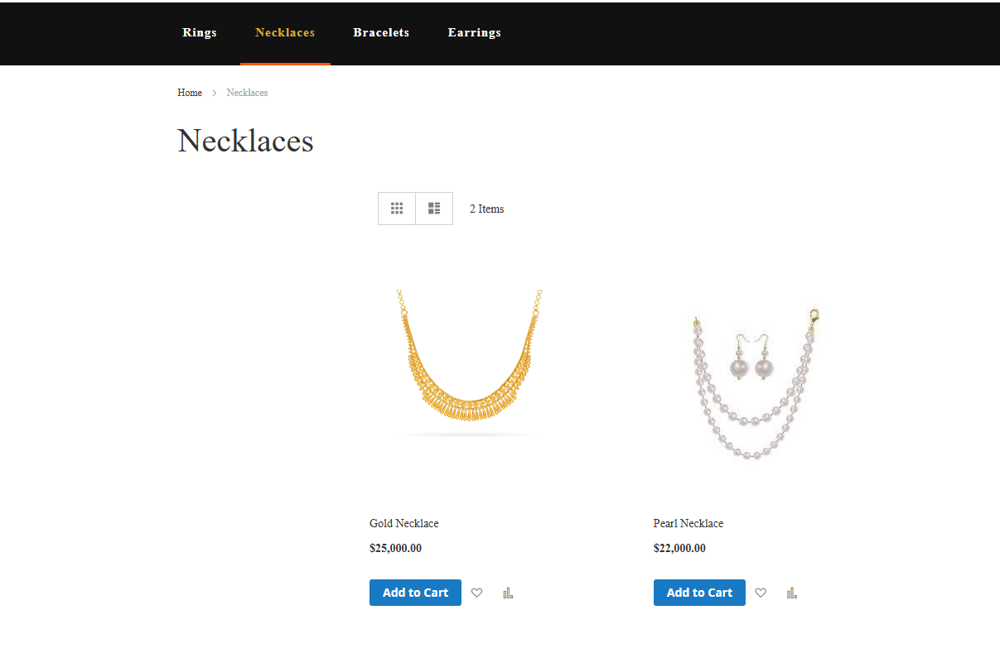
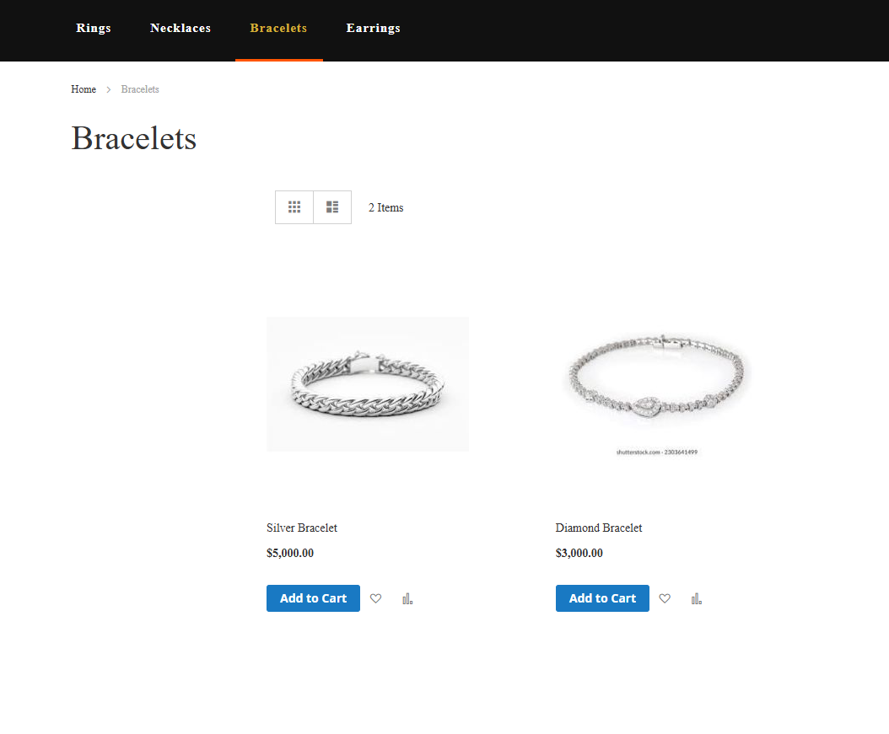
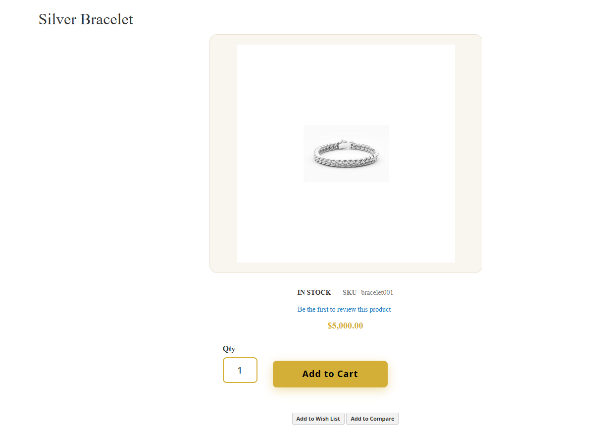
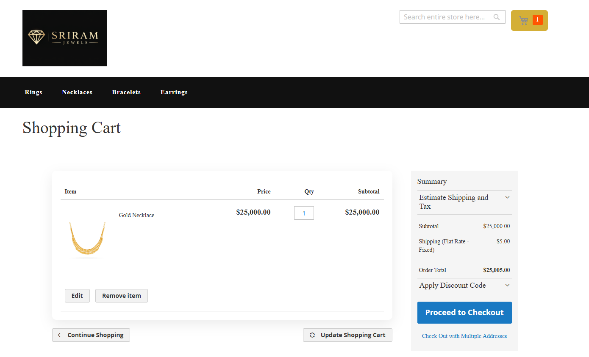

# 💎 Sriram Jewelry Store – Magento Frontend Project


This project is a **Magento 2 frontend UI customization** created as part of a frontend assignment.
The goal was to design a **luxury-style jewelry e-commerce interface** inspired by modern jewelry brands.

---

## 🎥 Demo Video

[▶ Watch Project Demo](demo/Sriram-jewelry.mp4)


---

# 📌 Project Overview

This project demonstrates:

* Custom Magento **homepage design**
* Improved **category product listing layout**
* Clean **product detail page UI**
* Custom **navigation styling**
* Custom **footer layout**
* Responsive design improvements

---

# 🛠 Tech Stack

* Magento 2
* PHP
* HTML
* LESS / CSS
* XAMPP (Apache + MySQL)
* OpenSearch
* Composer

---

# 📂 Important Custom Files

The main customizations are located in the Magento theme directory.

Key files modified:

```
app/design/frontend/Magento/Theme/templates/homepage.phtml
app/design/frontend/Magento/Theme/web/css/source/_extend.less
app/design/frontend/Magento/Theme/layout/cms_index_index.xml
```

---

# ✨ Features Implemented

## Custom Homepage

* Hero banner section
* Category grid (Rings, Necklaces, Bracelets, Earrings)
* Featured products section
* "Why Choose Us" section
* Luxury styled footer

## Category Page Improvements

* Removed Magento default sidebar
* Clean product grid layout
* Improved product card appearance

## Product Detail Page

* Large centered product image
* Improved Add-to-Cart button design
* Simplified product information layout

---

# 🎥 Project Demo Video

A short walkthrough of the Magento jewelry store UI.

[▶ Watch Demo](demo/Sriram-jewelry.mp4)

# 📷 Project Screenshots

---

## 🏠 Homepage






---

## 💍 Category Pages

### Rings



### Earrings



### Necklaces



### Bracelets



---

## 💎 Product Detail Page



---

## 🛒 Cart Page




---

# 🚀 How to Run the Project

Requirements:

* PHP
* Composer
* MySQL
* Apache
* Magento 2
* OpenSearch

Steps:

```
git clone https://github.com/Sriram1202/Sriram-jewelry-store.git
cd magento2
composer install
php bin/magento setup:upgrade
php bin/magento cache:flush
```

Then open in browser:

```
http://localhost
```

---

# 👨‍💻 Author

Sriram

GitHub:
https://github.com/Sriram1202
